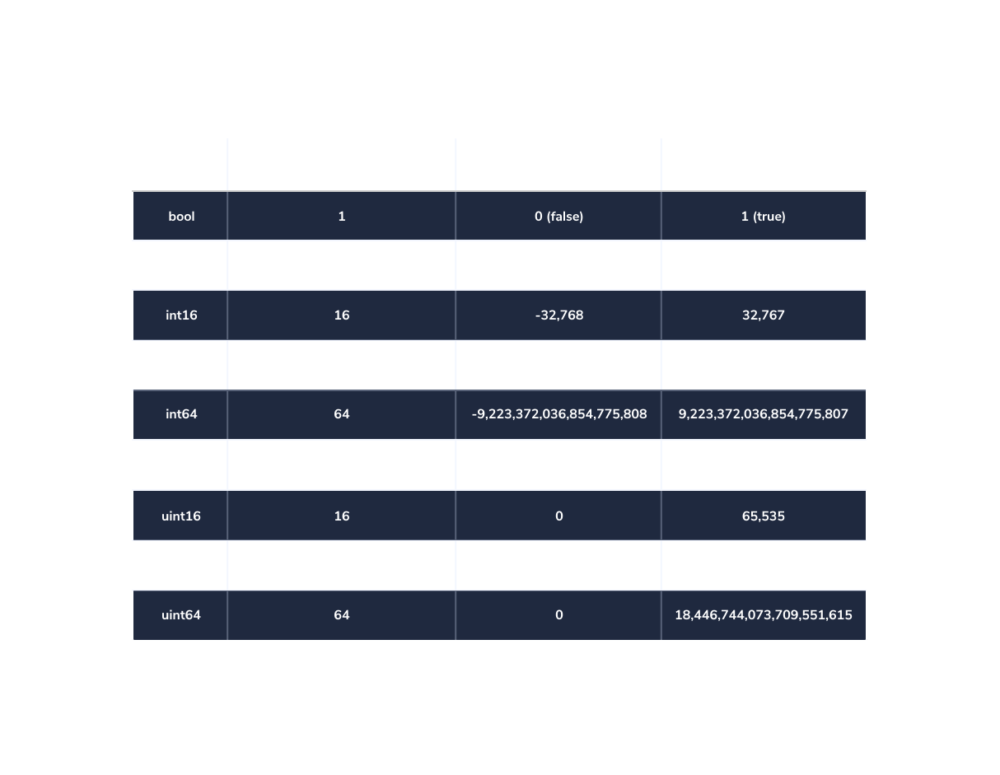

# Basic Numeric Types

Go has 15 different numeric types that fall into the three categories: `int`, `float`, and `complex`. That means there are 15 different ways to describe a number in Go.

- 11 different integer types
- 2 different floating-point types
- 2 complex number types.

Types also indicate how many bits (binary digits) will be used to represent the data. Fewer bits means fewer different possible values for the data, enforced as a strict minimum and maximum value for integers and less precision for floats and complex numbers. Fewer bits also means less data to save, so it will use less of a computer’s memory to hold onto that data. It may be tempting to use types that can take a larger range of values, but it can slow down a computer’s performance or cause the computer to run out of memory.

Integers can be either signed or unsigned. Signed can be negative, while unsigned can only be positive. As a result an unsigned integer's max value is higher. Example: `int8` can store numbers from -128 to 127, while `uint8` can store values from 0 to 255.

Go also has a boolean type which only needs 1 bit to store a value: 0 represents `false` and 1 represents `true`.

