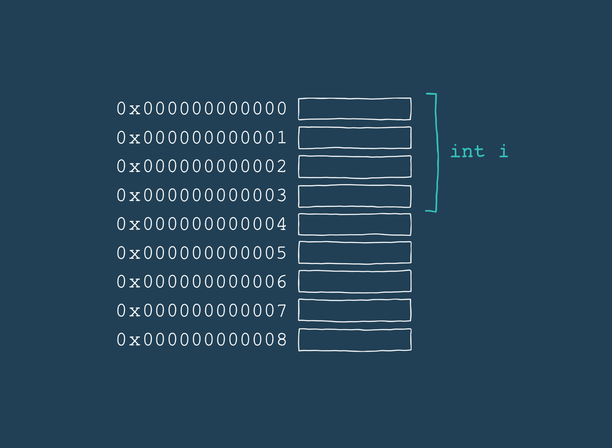

# Addresses

Imagine being in class, when we hear an important detail, we write it down in a notebook for reference later. This same idea of storing important information somewhere is the reason why we declare variables. But instead of writing information down in a notebook, a computer sets aside some space in its memory to store the value. The space that the computer allocates is called an address. Each address is marked as a unique numerical hex value like: `0x1400000e0f8`.

> Hex or Hexadecimal which is a way of representing 16 digit numbers

Every time we use a variable, what we’re doing is retrieving the value stored at the variable’s address. Here’s a simple visualization:



To find a variable’s address we use the `&` operator followed by the variable name, like so:

```go
x := "My very first address"

fmt.Println(&x)
// Output: 0x14000112020
```
